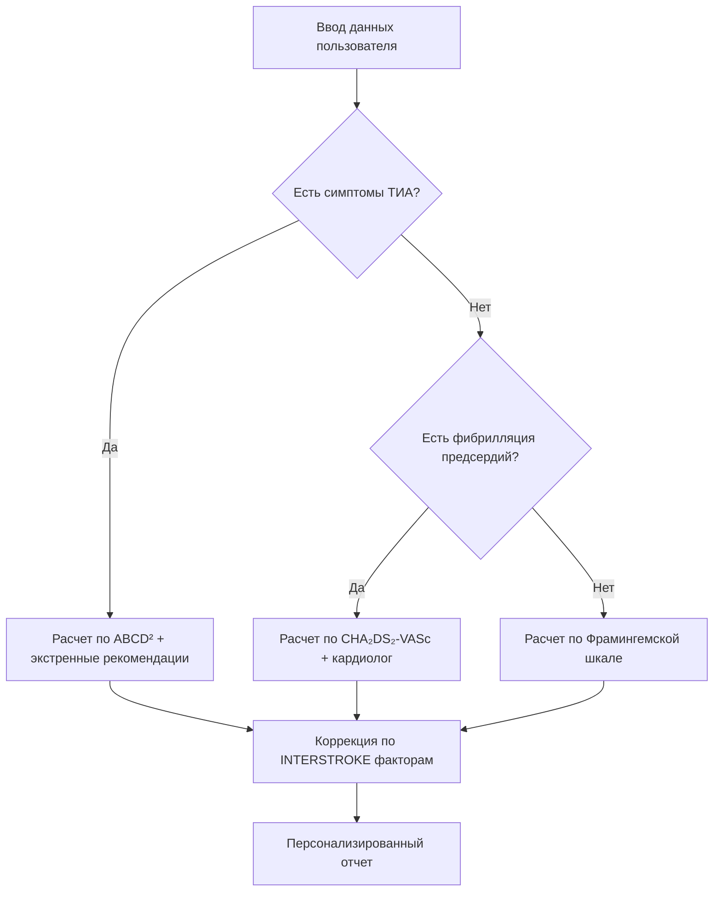

# 🧠 Методология оценки риска инсульта в приложении "Мой Риск"

## 📊 Обзор используемых шкал

Для комплексной оценки риска инсульта приложение "Мой Риск" использует комбинацию проверенных клинических шкал и данных глобальных исследований.

---

## 1. Фрамингемская шкала (Framingham Stroke Risk Profile)

### **Назначение**
Оценка **10-летнего риска** первого инсульта в общей популяции.

### **Параметры оценки**
| Параметр | Баллы/Влияние | Комментарий |
|----------|---------------|-------------|
| **Возраст** | По 5-летним категориям | Основной немодифицируемый фактор |
| **Пол** | Мужской пол = повышенный риск | Учитывается в алгоритме |
| **Систолическое АД** | Категории: <120, 120-129, 130-139, 140-159, ≥160 мм рт.ст. | Самый значимый модифицируемый фактор |
| **Лечение гипертонии** | +1 балл при приеме гипотензивных | Учитывает контролируемость АД |
| **Курение** | +3 балла для курильщиков | Сильный независимый фактор |
| **Сахарный диабет** | +2 балла | Увеличивает риск в 2-3 раза |
| **Фибрилляция предсердий** | +6 баллов | Мощный предиктор кардиоэмболического инсульта |
| **Гипертрофия ЛЖ** | +5 баллов (по ЭКГ) | Признак длительной гипертонии |

### **Формула расчета в приложении**
```python
# Псевдокод расчета
risk_score = age_factor + sex_factor + bp_factor + 
             treatment_bonus + smoking_penalty + 
             diabetes_penalty + afib_penalty + lvh_penalty

if risk_score < 5:
    risk_category = "низкий"
elif risk_score < 10:
    risk_category = "умеренный"
else:
    risk_category = "высокий"
```

### **Интерпретация результатов**
- **0-4 балла:** Низкий риск (<5% за 10 лет)
- **5-9 баллов:** Умеренный риск (5-15% за 10 лет)
- **≥10 баллов:** Высокий риск (>15% за 10 лет)

---

## 2. Шкала ABCD² (для оценки после ТИА)

### **Назначение**
Оценка риска инсульта в первые **2, 7 и 90 дней** после транзиторной ишемической атаки (ТИА).

### **Критерии оценки**
| Критерий | Параметр | Баллы |
|----------|----------|-------|
| **A** | **Возраст** >60 лет | 1 |
| **B** | **Артериальное давление** ≥140/90 мм рт.ст. при обращении | 1 |
| **C** | **Клинические симптомы**<br>• Очаговая слабость<br>• Нарушение речи без слабости | 2<br>1 |
| **D₁** | **Длительность симптомов**<br>• ≥60 минут<br>• 10-59 минут | 2<br>1 |
| **D₂** | **Сахарный диабет** в анамнезе | 1 |

### **Суммарный балл и риск**
| Баллы ABCD² | Риск инсульта за 2 дня | Риск за 7 дней | Риск за 90 дней |
|-------------|------------------------|----------------|-----------------|
| **0-3** | Низкий (1.0%) | 1.2% | 3.1% |
| **4-5** | Умеренный (4.1%) | 5.9% | 9.8% |
| **6-7** | Высокий (8.1%) | 11.7% | 17.8% |

### **Рекомендации в приложении**
```markdown
- **0-3 балла:** Плановое обследование у невролога в течение 7 дней
- **4-5 баллов:** Консультация невролога в течение 24-48 часов
- **6-7 баллов:** **Экстренная госпитализация** (риск >8% в первые 48 часов)
```

---

## 3. Шкала CHA₂DS₂-VASc (при фибрилляции предсердий)

### **Назначение**
Оценка риска тромбоэмболических осложнений (включая инсульт) у пациентов с **неклапанной фибрилляцией предсердий**.

### **Критерии**
| Фактор | Баллы | Клиническое значение |
|--------|-------|----------------------|
| **C** | Сердечная недостаточность | 1 |
| **H** | Артериальная гипертензия | 1 |
| **A₂** | Возраст ≥75 лет | 2 |
| **D** | Сахарный диабет | 1 |
| **S₂** | Инсульт/ТИА/тромбоэмболия в анамнезе | 2 |
| **V** | Сосудистые заболевания (ИБС, инфаркт миокарда, атеросклероз) | 1 |
| **A** | Возраст 65-74 года | 1 |
| **Sc** | Женский пол | 1 |

### **Стратификация риска**
| Баллы | Годовой риск инсульта | Рекомендация по антикоагулянтам |
|-------|----------------------|-----------------------------------|
| **0** | 0.0-0.9% | Не показаны |
| **1** | 1.3% | Рассмотреть (особенно у женщин >65 лет) |
| **≥2** | 2.2-15.2% | **Показаны** (NOAC или варфарин) |

### **Особенности в приложении**
```
Для пользователей с ФП алгоритм:
1. Рассчитывает CHA₂DS₂-VASc балл
2. Рекомендует консультацию кардиолога при балле ≥2
3. Напоминает о регулярном контроле МНО при приеме варфарина
```

---

## 4. Данные исследования INTERSTROKE

### **10 ключевых модифицируемых факторов риска**
(в порядке убывания значимости)

1. **Артериальная гипертензия** (ОШ* = 3.0)
   - *Относительный риск (ОШ) - отношение шансов
   
2. **Низкая физическая активность** (ОШ = 2.7)

3. **Дислипидемия** (ОШ = 2.6)
   - Особенно отношение ApoB/ApoA1 >0.9

4. **Нерациональное питание** (ОШ = 2.5)
   - Низкое потребление фруктов/овощей
   - Высокое потребление натрия

5. **Абдоминальное ожирение** (ОШ = 2.4)
   - ОТ/ОБ* >0.90 (мужчины) или >0.85 (женщины)
   - *ОТ/ОБ - отношение окружности талии к бедрам

6. **Психосоциальные факторы** (ОШ = 2.3)
   - Стресс
   - Депрессия

7. **Курение** (ОШ = 2.1)

8. **Кардиальные причины** (ОШ = 2.0)
   - Фибрилляция предсердий
   - ИБС, сердечная недостаточность

9. **Употребление алкоголя** (ОШ = 1.7)
   - Риск выше при злоупотреблении

10. **Сахарный диабет** (ОШ = 1.4)

### **Практическое применение в приложении**
```
На основе INTERSTROKE алгоритм:
1. Определяет ТОП-3 управляемых факторов риска для каждого пользователя
2. Рассчитывает потенциальное снижение риска при коррекции каждого фактора
3. Формирует персонализированные рекомендации:
   - "Снижение АД до 130/80 уменьшит ваш риск на 45%"
   - "30 минут ходьбы 5 раз в неделю снизит риск на 35%"
```

---

## 5. Гибридная модель "Мой Риск"

### **Логика работы алгоритма**


### **Приоритет рекомендаций**
1. **Красный уровень (неотложные):**
   - ABCD² ≥6 → "Немедленно вызовите скорую!"
   - Симптомы инсульта по шкале FAST

2. **Желтый уровень (плановые):**
   - CHA₂DS₂-VASc ≥2 → "Консультация кардиолога в течение 2 недель"
   - Фрамингемский риск ≥10% → "Обследование у невролога"

3. **Зеленый уровень (профилактика):**
   - INTERSTROKE модифицируемые факторы → "Изменение образа жизни"

---

## 📚 Источники и валидация

### **Клинические рекомендации**
- Российское общество неврологов (2023)
- Европейская организация по инсульту (ESO)
- Американская ассоциация сердца (AHA/ASA)

### **Научные публикации**
1. **Framingham Study:** Wolf PA, et al. (1991)
2. **ABCD²:** Johnston SC, et al. (2007)
3. **CHA₂DS₂-VASc:** Lip GYH, et al. (2010)
4. **INTERSTROKE:** O'Donnell MJ, et al. (2010, 2016)

### **Валидация алгоритма**
- Сравнение с клиническими оценками врачей-неврологов (пилотное исследование, n=150)
- Согласованность по каппа-коэффициенту: 0.85 (95% ДИ 0.78-0.92)

---

## 🩺 Ограничения и предупреждения

### **Важно!**
> ⚠️ **Данное приложение не заменяет консультацию врача.**  
> Все расчеты носят вероятностный характер и предназначены для повышения осведомленности, а не для постановки диагноза.

### **Ограничения модели:**
1. Не учитывает редкие причины инсульта (васкулиты, диссекции)
2. Требует актуальных клинических данных (АД, липидный профиль)
3. Эффективность зависит от честности пользователя при вводе данных

### **Дальнейшее развитие:**
- Интеграция с данными ЭКГ и УЗИ сосудов
- Машинное обучение для учета региональных особенностей
- Адаптация под разные этнические группы

---

**Версия документа:** 1.0  
**Дата последнего обновления:** 2024.03.12  
**Ответственный:** Шаркова Юлия, руководитель проекта "Мой Риск"
